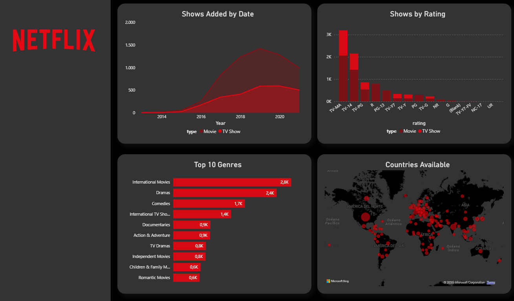
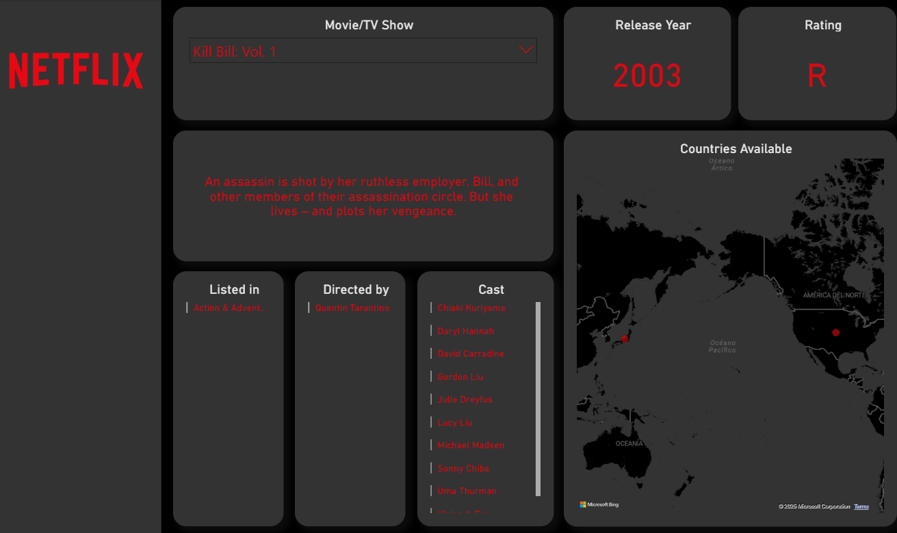

# 🎬 Netflix Titles — SQL + Power BI (Portfolio Project)

This repository shows an end‑to‑end **data analysis workflow** on the public *Netflix Titles* dataset:

* **Clean & model** the raw Excel with **MySQL 8 views** (no manual editing).
* **Analyze** with small, reusable **SQL queries** that answer business‑like questions.
* **Visualize** the results in an **interactive Power BI** dashboard.

---

## 📦 Repository Structure

```
├─ data/
│  └─ netflix_titles.xlsx
├─ sql/
│  ├─ 00_create_view_netflix_clean.sql
│  ├─ 01_create_view_countries.sql
│  ├─ 02_create_view_genres.sql
│  ├─ 10_movies_vs_tv.sql
│  ├─ 11_titles_added_by_year.sql
│  ├─ 12_ratings_distribution.sql
│  ├─ 13_top_countries.sql
│  ├─ 14_top_genres.sql
│  ├─ 15_top_directors.sql
│  └─ 16_movie_duration_stats.sql
├─ powerbi/
│  └─ Netflix+Dashboard+with+Data.pbix
└─ images/
   ├─ sql_files_tree.png
   ├─ powerbi_overview.png
   └─ powerbi_details.png
```
---

## 📊 Dashboard (Power BI)

**Overview**


Includes:

* *Shows Added by Date* (stacked area by type)
* *Shows by Rating* (bar, split by type)
* *Top 10 Genres* (bar)
* *Countries Available* (map)

**Detail page**


Includes:

* Title selector with release year and rating
* Description, listed‑in, directors, and cast
* Availability by country (map)

---

## 🚀 Quick Start (SQL)

1. **Create database & table** (only once):

```sql
CREATE DATABASE IF NOT EXISTS netflix_db;
USE netflix_db;

CREATE TABLE IF NOT EXISTS netflix_titles (
  show_id       VARCHAR(20),
  type          VARCHAR(20),
  title         VARCHAR(512),
  director      TEXT,
  cast          TEXT,
  country       TEXT,
  date_added    VARCHAR(40),
  release_year  INT,
  rating        VARCHAR(20),
  duration      VARCHAR(30),
  listed_in     TEXT,
  description   TEXT
);
```

2. **Import the data**: in MySQL Workbench → *Table Data Import Wizard* → select `data/netflix_titles.xlsx` → target table `netflix_titles`.
3. **Create clean views** (run in order):

   * `00_create_view_netflix_clean.sql` → defines **`netflix_clean`** (parses `date_added`, extracts minutes/seasons, normalizes NULLs).
   * `01_create_view_countries.sql` → **`v_countries`** (one row per country).
   * `02_create_view_genres.sql` → **`v_genres`** (one row per genre).
4. **Run the analysis queries** (each is independent once the views exist):

   * `10_movies_vs_tv.sql` → Movies vs TV Shows counts.
   * `11_titles_added_by_year.sql` → titles added per year.
   * `12_ratings_distribution.sql` → maturity ratings distribution.
   * `13_top_countries.sql` → top countries by title count (uses `v_countries`).
   * `14_top_genres.sql` → top genres (uses `v_genres`).
   * `15_top_directors.sql` → most prolific directors (splits comma‑separated `director`).
   * `16_movie_duration_stats.sql` → runtime stats + bucketed distribution.
5. **Open the dashboard**: `powerbi/Netflix+Dashboard+with+Data.pbix`.

   * If you want to keep Excel as the source → just **Refresh**.
   * To connect to **MySQL**, go to *Home → Transform data → Data source settings → Change Source*, choose MySQL, enter server/database, then **Refresh**.

---

## 🧰 Requirements

* **MySQL 8.0+** (uses `JSON_TABLE`).
* **MySQL Workbench** (optional but convenient).
* **Power BI Desktop** to open the PBIX.

---

## ℹ️ Notes

* Portfolio/educational use. Any equivalent version of the dataset works—the views normalize key fields.
* Feel free to extend with more queries and visuals.
* License: **MIT**.

---

## 🛠️ Tools & Technologies
- **SQL (MySQL / PostgreSQL)** for querying  
- **Tableau Public** for visualization  
- **Excel** as the raw data source
  
---

## 👩‍💻 Author
Bianca Tortore 📍 Based in Berlin, Germany 🌐 Spanish | English | Italian | Learning German (A1) 🔗 [LinkedIn](https://www.linkedin.com/in/bianca-tortore-818349150/)  

*Updated today*
